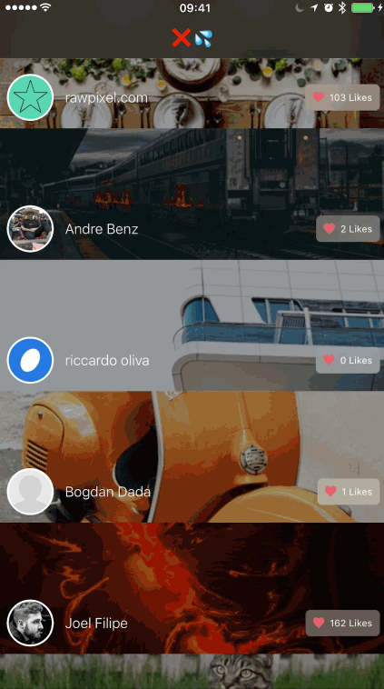
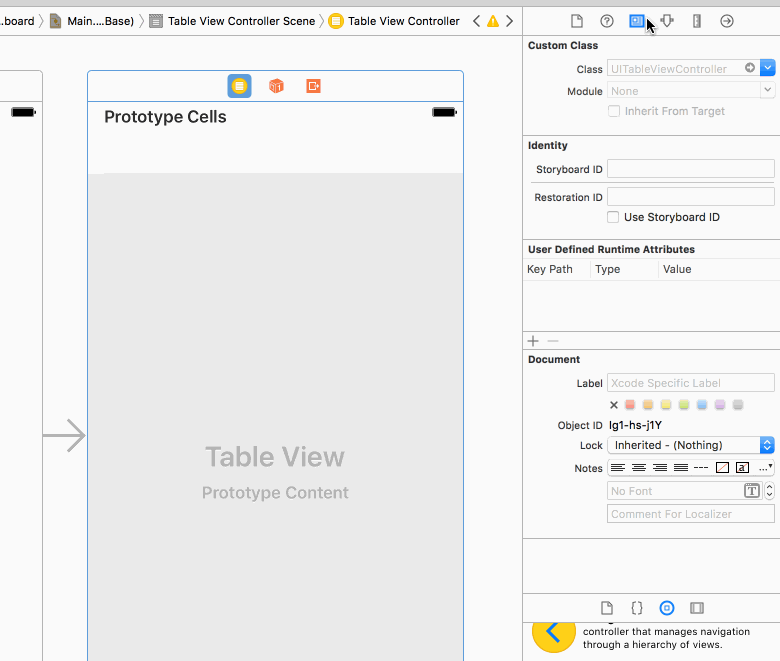
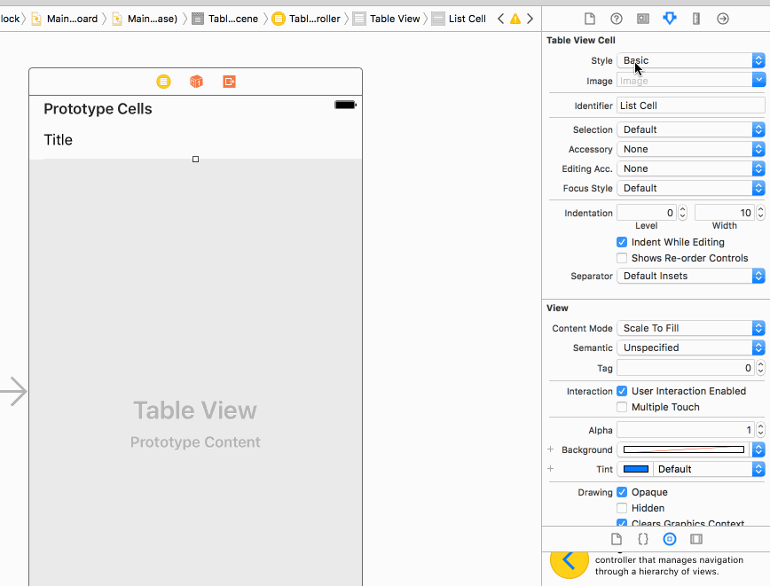

# SESSION 3

# 3.1 Lists

In this final session, we're up to covering some concepts that are really important to put an app together.

We'll aim at something like this:



Now, that's the _aim_. You may not get to adding circular images for the userProfile, or the number of likes for a user, but it's what we can do with the tools we've learned and a few hours.

We've included the source code for the app at the end of this tutorial.

## 3.1.1 Using real data

Get some data using `/collections` similarly to how we hit `/photos/random`. It dumps a _lot_ of data, so we haven't included it inline this time. Just hit the endpoint and have a look :)

Since there is a lot of data, and we'll be using a fair bit of it, you might want to map the JSON into a model class.

Swift's `struct` is great for declaring models. See https://developer.apple.com/library/content/documentation/Swift/Conceptual/Swift_Programming_Language/ClassesAndStructures.html for more info.

Try not to spend too much time on this initially, it's something easy to come back to after getting through TableViews and the Navigation section.

## 3.1.2 UITableView

`UITableView` instances are how a one dimensional list of items are displayed on iOS. Because of the resource constraints on iOS, and because they are often used to display long, complex lists, they include a fair bit more complexity than a non-table view controller. We'll go through this all step by step.

First, head to `main.storyboard` and drag out a table view controller from the Objects Viewer. We'll make this the storyboard entry point so drag the big arrow from the view controller we were working on previously to the new table view controller. We'll add some navigation between the two later.

Now we have a table view controller in the storyboard, we need to add a UITableViewController subclass to drive it. First, select `ViewController.swift`. Add a new file and select 'Cocoa Touch Class' from the wizard. We'll subclass UITableViewController and since we're using a storyboard, we don't need a xib (pronounced 'zib'). Selecting `ViewController.swift` is the easiest way to make sure the group and save location is set right. We need to do this because the default location of the file wouldn't be picked up by the compiler now that Cocoapods is in use.


To wire the UITableViewController subclass to the table view controller in the storyboard, we need to set the 'Custom Class' attribute of the Table View Controller in the storyboard (under the Identity Inspector, next to the Attibute Inspector) to the name of the UITableViewController subclass.



Table view controllers have a few required methods to display content on the screen.

```swift
override func numberOfSections(in tableView: UITableView) -> Int
```
This is required to give the number of sections in the table view. The simplest example of a section is the little header with the letter name in any table sorted alphabetically. In our app, we won't be using sections so `return 1`. This is very common.

```swift
override func tableView(_ tableView: UITableView, numberOfRowsInSection section: Int) -> Int
```
This returns the number of rows in the given section. This should align with the data we're using to drive the table. We only have one section so we can ignore the section parameter. For now, we'll just `return 5`.

```swift
override func tableView(_ tableView: UITableView, cellForRowAt indexPath: IndexPath) -> UITableViewCell
```
This is the function that creates and returns a cell. This function should be implemented by dequeuing a cell with a reuse identifier.

Reuse identifiers allow the table view to maintain a pool of allocated views to use as the table cells. The table view can then avoid the unnecessary work of creating and destroying table view cells and instead just reconfigure existing cells.

Since we're using a storyboard, we'll set the reuse identifier to 'List Cell' on the table view controller in the storyboard. This value has to match the value in the `tableView(_:cellForRowAt:)` implementation. We'll also set the type of the table view cell to 'Basic'. We'll develop a custom UITableViewCell subclass in 3.1.3.


Let's make our implementation of `tableView(_:cellForRowAt:)` as below for now.
```swift
override func tableView(_ tableView: UITableView, cellForRowAt indexPath: IndexPath) -> UITableViewCell {
    let cell = tableView.dequeueReusableCell(withIdentifier: "List Cell", for: indexPath)
    cell.textLabel?.text = "\(indexPath.row)"
    return cell
}
```

The other stubbed out methods before the 'Navigation' mark won't be needed.

Run the project and you should see cells with the numbers 0 to 4.

Now, rework `tableView(_:numberOfRowsInSection:)` and `tableView(_:cellForRowAt:)` methods to display some information from the model you wrote in 3.1.1.

Run the project again to verify that the model is now hooked up to the table view.

## 3.1.3 Custom UITableViewCell Subclasses

To do anything interesting with a table view, you'll have to write a custom `UITableViewCell` subclass.

Add a new file, this time a `UITableViewCell` subclass. We won't need either of the boilerplate functions.

Select the cell with the reuse identifier we set before. Update its 'Custom Class' to match the `UITableViewCell` class you just created. Set the style of the cell (under the 'Attributes Inspector') to 'Custom'.

Add an `@IBOutlet` for any view to be configured. GO to the Connections Inspector and drag between the outlet for connecting and the view to be connected to.


UITableViewCells are `UIView` subclasses so a subclass view can be created in InterfaceBuilder with Autolayout. Table views only scroll vertically so cell heights aren't constrained, but their width is fixed to the width of the table view. Cell heights can be custom, but in this case it is easier to set a custom 'Row Height' in the Size Inspector. The example app had a fixed height of 150. Our cells will have fixed dimensions (similar to the view controller's view from before).



Then in the cell for item at index path, cast the `UITableViewCell` returned by `tableView.dequeueReusableCell(withIdentifier:for:)` to your `UITableViewCell` subclass. Use a force cast for this. The string reuse identifier is way more dangerous than the type mismatch.

## Summary

We just learned about table views, created our own custom cell and displayed the model data we downloaded using the table view. We're like, semi-pro!

# 3.2 Navigation

It's time to add navigation to the app, pushing to the view on with the selected collection.

## 3.2.1 Segues

Segues are a way of representing navigation flow in the storyboard. Whether that's a good idea is up for debate but that's for another time.

Segues bolt on to a few different things - there are some methods in `UIViewController`, and they're their own object too (`UIStoryboardSegue`).

Embed the table view controller in a navigation controller by selecting the TableViewController then choosing Editor > Embed In > Navigation Controller.

To create the segue, control drag from TableViewController to ViewController and we'll select the 'Show' type.

Again we have to give it a name. Give it the Identifier "Segue" in the Attributes Inspector.

Once it's named, we can add the following to out table view controller. This performs the segue with the name we just added.
```swift
override func tableView(_ tableView: UITableView, didSelectRowAt indexPath: IndexPath) {
    performSegue(withIdentifier: "Segue", sender: indexPath)
}
```

`UIViewController` also has the method `prepare(for:sender:)` Which allows you to prepare for the segue that's about to happen. The value we passed into `performSegue(withIdentifier:sender)` is passed into this method. The `UIStoryboardSegue` object has a reference to the destination view controller (see https://developer.apple.com/reference/uikit/uistoryboardsegue)

When using segues, this is typically used to pass data to the destination view controller.

We can use this to push to the selected collection into the view controller that displays the time to change the background image it displays. Add a property on the view controller to be set and give it a try.

>For more on segues see https://developer.apple.com/library/content/featuredarticles/ViewControllerPGforiPhoneOS/UsingSegues.html

## 3.2.2 Memory management

We're using some pretty big photos and we're loading and 'unloading' view controllers. I say 'unloading' because of Swift's memory management model and a very common error.

In CLOSURES IN-DEPTH (1.3) we talked a little about how to work with closures and avoid reference cycles. Since our view controllers refer to the images, if the view controller captures itself through a reference cycle, the images will never be released. View controllers in navigation to different items aren't re-used. Make sure to use `[weak self]` to allow the view controllers to be released.

## Summary

We added a table view, learned how to make custom table view cells, navigate using segues, and be careful about memory management.

# Closing remarks

Hopefully we've given you some tools to get started learning iOS. We've by no means done a comprehensive tutorial, but we've hopefully given enough of a walkthrough so you know a few milestones to help you on your way.

As with all things, the best way to improve your iOS programming skill is to practise. Put something up on the store!

# Example Code

As promised, here's example code for the app shown in the beginning of this tutorial.

The app is well organised and commented so you can find your way around it. We've written it just as we would any other production app (minus some logging and analytics).

It contains some sample JSON so it'll work away from the hacky Unsplash mirror we set up.

Credit to Ethan for working on the initial networking call and image display (Section 2), Javan for some very minor fixes and Goutham for extending it into the visual masterpiece it is, and cleaning everything up.

https://github.com/redeyeapps/UnsplashScreenSaver
